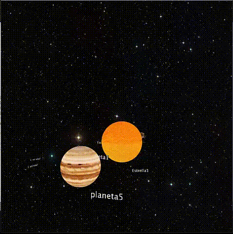

# Sistema planetario
Practica 3 de CIU
# CIU - Práctica 3
# Rubén García Quintana

## Visualización de sistema planetario.

Esta practica consiste en utilizar lo aprendido sobre tranformaciones de elementos 3D para realizar el diseño de un sistema planetario.

Aqui podemos ver un gif con una pequeña demostración de su ejecución. 

### Desarrollo de la práctica

Para la realizacion de esta practica, se creado distintas clases, una general llamada "sistema" que acogera los distintos elementos del sistema planetario, representados haciendo uso de las clase "planeta" y "satelite".

Para dar la textura a los diferentes elementos se ha usado la clase PImage que nos permite usar images guardadas en la carpeta data para aplicarlas a los objetos PShape.

